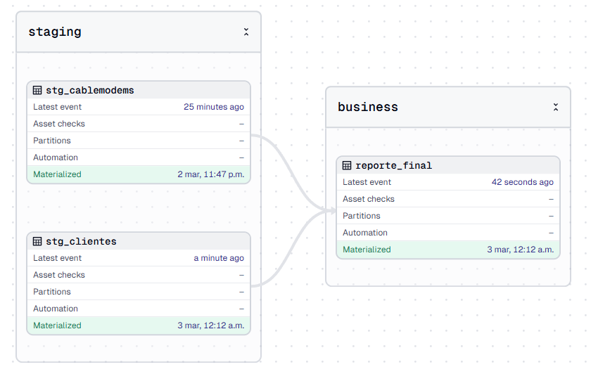
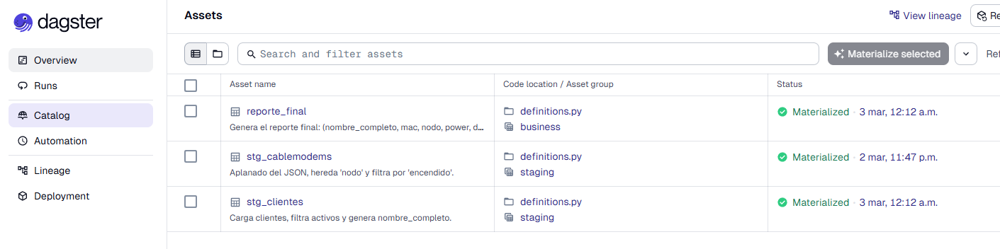
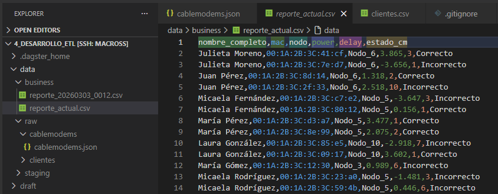
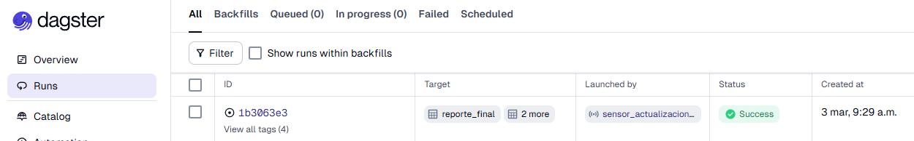
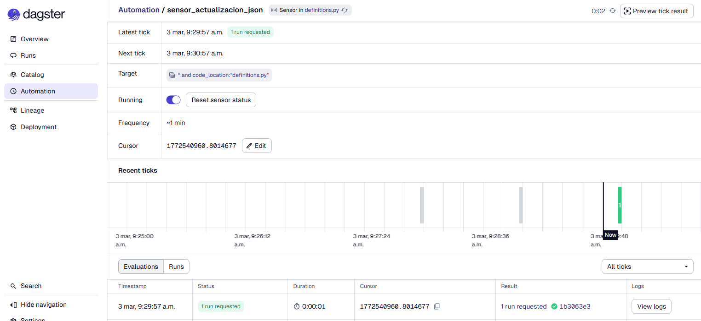
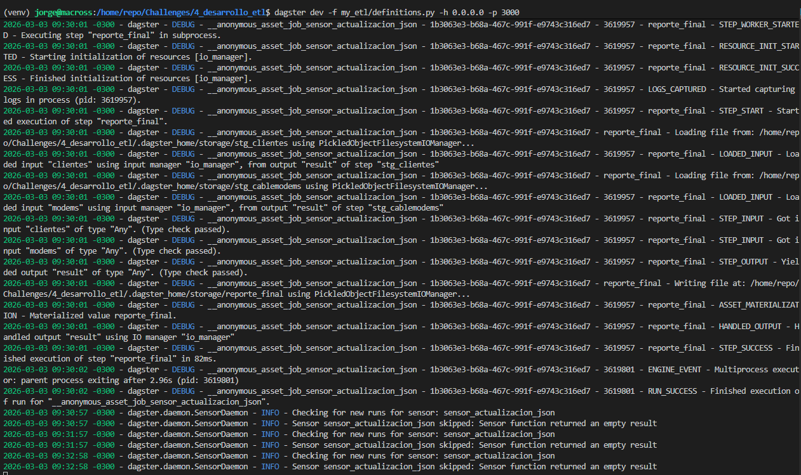
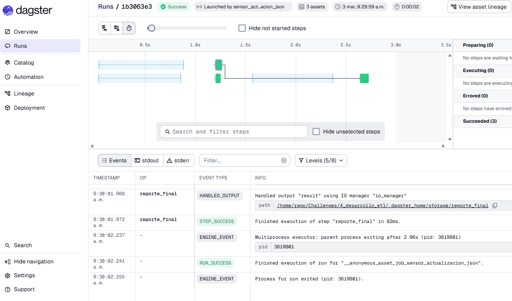

# 4 - Desarrollo ETL

Este proyecto implementa un data pipeline usando Dagster para dos fines, como orquestador y catálogo de datos. El proceso ETL ingesta datos en bruto en dos archivos de datos que se actualizan con cierta frecuencia.
El proceso de transformación se realiza a través de una capa de staging, donde se limpian y transforman los datos, y luego se produce un reporte final con el análisis del estado de los cablemodems.

## Características principales
- ✅ Ingestión de datos automática
- ✅ Transformación de datos multicapa
- ✅ Disparo por autodetección de cambios en los archivos raw
- ✅ Versionado de reporte histórico
- ✅ Arquitectura de datos basado en assets

## Lógica de Negocio

### Reglas de Estado de Cablemodems
El sistema evalúa la salud de los cablemodems basado en:
- **Power Level**: Debe ser `mayor que 0`
- **Delay**: Debe ser menor que `4 milisegundos`

Los Modems que cumplen con ambos requisitos son clasificados como **"Correcto"**, en otro caso será **"Incorrecto"**.

### Calidad de Datos
- En el reporte se incluyen sólo clientes activos
- Sólo se procesan cablemodems en estado `On`
- La medición de potencia se redondea a `3 decimales`
- Todos los reportes son marcados con `timestamp` para posible auditoría

## Arquitectura


## Data Pipeline
```
Datos en Bruto (Raw) → Capa Staging → Capa Business (BI)
```
Se observan los Assets materializados y dando forma al Pipeline.



1. **Capa Raw** (`data/raw/`)
   - `clientes/clientes.csv` - Información de Clientes
   - `cablemodems/cablemodems.json` - Datos de telemetría de Cable modems

2. **Capa Staging** (`data/staging/`)
   - `stg_clientes` - Clientes activos filtrados con su nombre
   - `stg_cablemodems` - Datos de cable modem filtrado y aplanado

3. **Business Layer** (`data/business/`)
   - `reporte_final` - Reporte Final con análisis de estado de cable modems

### Assets de Staging
Se observa la materialización exitosa de los assets cada vez que sucede.


Aquí se menciona en detalle que sucede en cada parte del pipeline y en que etapa del procesamiento ocurre.

#### stg_clientes
- Carga datos de clientes desde CSV
- Filtra sólo clientes activos (`estado == True`)
- Se crea el campo `nombre_completo` (Nombre + Apellido)
- Devuelve: `id_cliente`, `nombre_completo`

#### stg_cablemodems
- Carga datos de cable modems desde JSON
- Aplana la estructura JSON
- Hereda `nodo` e `id_cliente` del nivel superior
- Redondea `power` a 3 decimales
- Filtra sólo modems encendidos (`encendido == True`)
- Devuelve: `id_cliente`, `mac`, `nodo`, `power`, `delay`

### Assets de Business
Aquí se genera el reporte final.
#### reporte_final
- Se realiza un join entre clientes y cablemodems (1:N)
- Calcula `estado_cm` (estado de cable modem):
  - **Correcto**: `power > 0` y `delay < 4`
  - **Incorrecto**: Otro caso
- Genera reporte con timestamp
- Outputs:
  - `reporte_{timestamp}.csv` - Snapshot histórica
  - `reporte_actual.csv` - ültima versión

**Columnas del Reporte:**
- `nombre_completo` - Nombre completo del cliente
- `mac` - MAC address del Cablemodem
- `nodo` - Nodo de Red
- `power` - Nivel de potencia de señal
- `delay` - Delay
- `estado_cm` - Estado del modem (Correcto/Incorrecto)



## Automatización
La automatización del pipeline se basa en el uso del Sensor de cambios en los archivos de datos de la etapa Raw. Este sensor monitorea cada minuto si hay algún cambio y dispara las actualizaciones y recalculo en base a los nuevos datos. El proceso genera también un nuevo versionado del reporte para histórico.

- Verifica cada 60 segundos
- Detecta modificaciones de archivo usando el timestamp
- Autimáticamente dispara el pipeline completo cuando el cambio es detectado
- Ejecuta: `stg_cablemodems` → `stg_clientes` → `reporte_final`



### Sensor de Archivos Raw
Se aprecian los ticks donde se produce el monitoreo (chequeo) de la situación de los archivos en etapa Raw.
El sensor `cablemodem_json_sensor` monitorea cambios en el archivo JSON de cablemodems.



Debajo se observa el stream de logs generados al detectar cambios en el archivo `.json` generado como parte de las pruebas de funcionamiento.



## Instalación

### Prerequisitos
- Python 3.8+
- pip

### Dependencias
- **pandas** - Manipulación de datos y análisis
- **dagster** - Orquestación
- **dagster-webserver** - Web UI para monitoreo

### Setup
```bash
# Instalar dependencias
pip install -r requirements.txt

# Setear el Home de Dagster
export DAGSTER_HOME=$(pwd)/.dagster_home
```

## Inicio y Consulta de Dagster

```bash
export DAGSTER_HOME=/home/repo/Challenges/4_desarrollo_etl/.dagster_home
dagster dev -f my_etl/definitions.py
```
### Acceso a la UI
Para acceder a la UI desde un navegador ir a: http://localhost:3000



## Mejoras Futuras
- Agregar chequeos de validación de datos
- Implementar manejo de errores y alertas
- Agregar soporte para multiples fuentes de datos
- Crear Dashboards analíticos
- Implementar porcesamiento incremental para grandes datasets
